# XFacta Exploratory Data Analysis Report

**Project:** XFacta — Multimodal Misinformation Detection on Social Media  
**Date:** June 2026  
**Milestone:** M4 — Exploratory Data Analysis Report

---

## 1. Introduction

### 1.1 Project Background

XFacta is a multimodal misinformation detection project focused on social media posts from X (formerly Twitter). The dataset covers content posted between January 2024 and January 2025. Each post is labelled as **True** or **False** and includes text plus one or more images, making this a multimodal classification task.

### 1.2 Dataset Overview

The analysis uses the following data sources:

| Source | Records | Key Columns |
|--------|---------|-------------|
| `batches.csv` (raw) | 2,400 | sample_type, batch_file, tweet_id, text, images, label, author, date_posted, topic, error_category |
| `batches_clean.csv` (processed) | 2,388 | Cleaned version of `batches.csv` with standardised categories and dates |
| `dev_test_clean.csv` (processed) | 2,387 | split (dev/test), text, images, label — used for development and evaluation |
| `dev.json` | 240 (dev) | text, images, label — balanced 50/50 |
| `test.json` | 2,160 (test) | text, images, label — balanced 50/50 |

The data spans 14 topic categories, including politics, society, entertainment, and sports, and 7 error categories for misinformation such as deepfakes, de-contextualization, misattributed images, and incorrectly captioned images.

### 1.3 EDA Goals

1. Understand dataset structure, quality, and balance
2. Identify patterns and relationships in misinformation
3. Test the initial hypotheses from the project proposal
4. Formulate a modelling question for the next phase

---

## 2. Univariate Analysis

### 2.1 Label Balance

The dataset is balanced between **True** and **False** labels across all main data sources. The `batches_clean` dataset contains 1,395 True and 993 False records, `dev_test_clean` contains 1,200 of each label, and both `dev.json` and `test.json` are balanced 50/50.

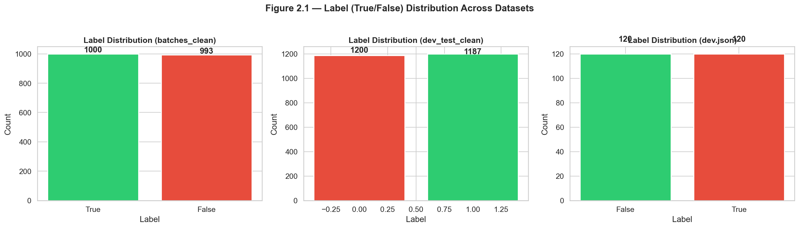

**Takeaway:** There is no class imbalance in the curated evaluation sets, so standard classification metrics are appropriate without resampling or class weighting.

### 2.2 Sample Type Distribution

The dataset separates samples into two provenance groups:

- **real_sample**: tweets from established news organisations such as CNN, BBC, Fox News, and The Guardian
- **fake_sample**: tweets flagged as misinformation, typically originating from individual accounts

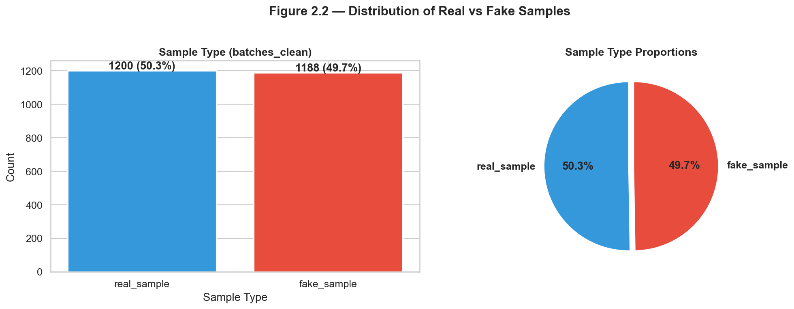

**Takeaway:** The near-equal split between the two source groups is useful for evaluation, but source type is strongly entangled with label. Any model that uses author identity directly risks learning a dataset artefact rather than a generalisable misinformation signal.

### 2.3 Error Category Distribution

Among the fake-labelled posts, the most common misinformation types are:

1. **Incorrectly Captioned Images** — the largest category
2. **De-contextualization** — real images used outside their original context
3. **Misattributed Images** — images attributed to the wrong event or person
4. **Deepfakes** — AI-generated synthetic images

Smaller categories include combination cases such as de-contextualization plus incorrect captioning, as well as named entity manipulation. Error categories are assigned only to False-labelled samples and should be treated as annotations rather than modelling inputs.

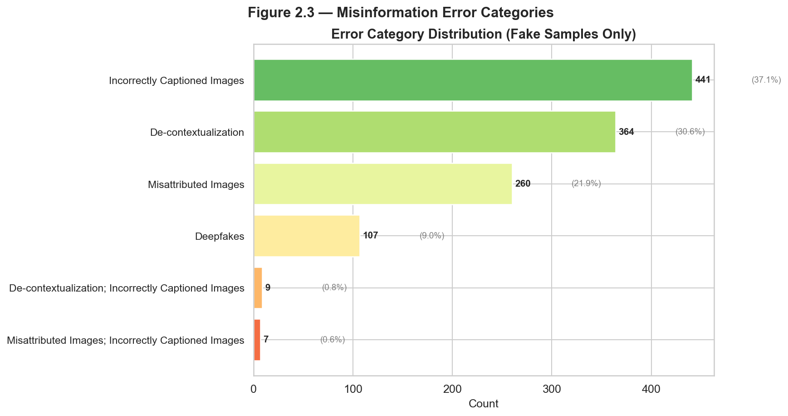

**Takeaway:** Most misinformation in XFacta involves **real images used deceptively** rather than fully synthetic content. This means a successful detector must reason across text and image, not just identify AI-generated visuals.

### 2.4 Topic Distribution

The most represented topics are:

- Society
- Politics-Warfare-Israel-Palestine
- Politics-United-States-Presidential-Election
- Politics-other
- Entertainment
- Politics-Warfare-Middle-East-Conflict

When fake samples are isolated, the topic distribution remains broadly proportional. Most topics sit in a fairly narrow fake-content range, while very small topic groups and the Unknown category contain few or no labelled entries.

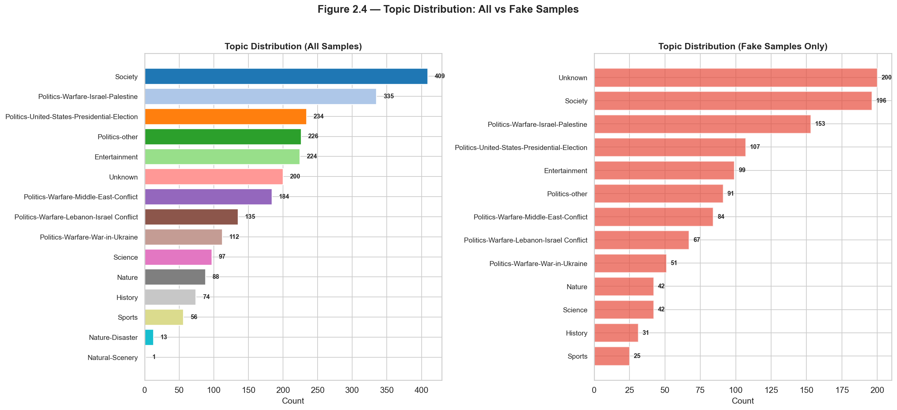

**Takeaway:** The dataset is reasonably balanced across topics, reducing the risk of topic-label confounding. Topic-stratified evaluation is still recommended to verify robustness.

### 2.5 Text Length Distribution

Fake posts are longer on average than real posts:

- **False (fake):** mean = 132 characters, median = 100, std = 142
- **True (real):** mean = 87 characters, median = 79, std = 37

Real posts are tightly clustered around short lengths, while fake posts show much higher variance and include very long outliers.

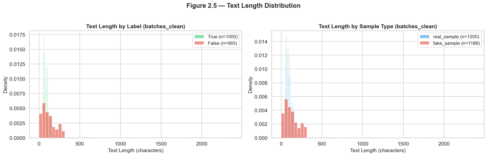

**Takeaway:** Text length provides a weak but measurable signal, but it is not strong enough to serve as a standalone feature.

---

## 3. Bivariate Analysis

### 3.1 Label vs Error Category

Error categories are exclusive to the False label:

- Deepfakes: 100% False
- Incorrectly Captioned Images: 100% False
- Misattributed Images: 100% False
- De-contextualization: 100% False

This is expected because the error type annotation is only applied after a post has already been identified as misinformation.

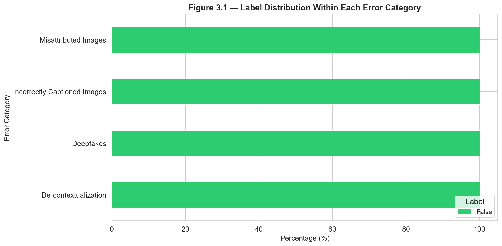

**Takeaway:** Error category cannot be used as an input feature because it is downstream of the label. It should instead be treated as an output target or an analysis dimension.

### 3.2 Label vs Topic

Conflict-related topics show slightly higher misinformation density than some other topics, but the differences are modest overall. Examples include:

- Politics-Warfare-Lebanon-Israel Conflict
- Politics-Warfare-Israel-Palestine
- Politics-Warfare-War-in-Ukraine
- Politics-Warfare-Middle-East-Conflict

More balanced topics include Sports, Entertainment, and Society.

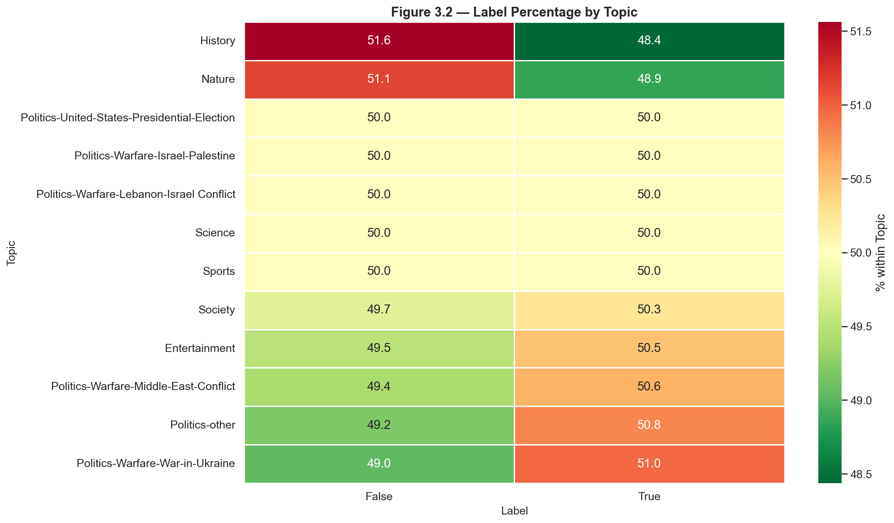

**Takeaway:** Topic patterns exist, but the dataset remains broadly balanced across topics. This supports fair comparison across topic groups and suggests that topic-aware modelling may improve robustness.

### 3.3 Image Presence vs Label

Over 99% of posts contain images, confirming that XFacta is fundamentally multimodal. Among image-bearing posts:

- Fake samples average slightly more images per post than real samples
- Multi-image posts are uncommon but appear a bit more often in the fake class

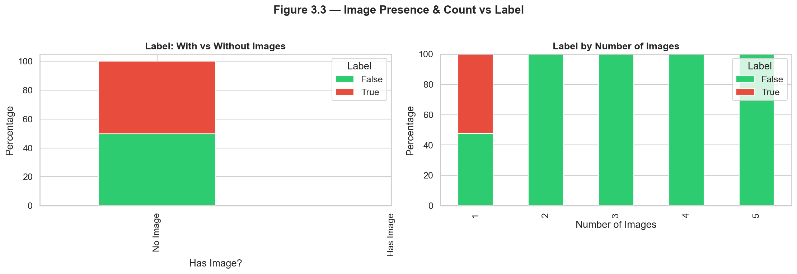

**Takeaway:** Image count is only a weak signal. The important information lies in the image content and how it aligns with the accompanying text.

### 3.4 Author Type vs Label

This is the clearest bivariate pattern in the dataset:

- News organisations are almost always labelled True
- Individual or flagging accounts are almost always labelled False
- Unknown authors occur mostly in the fake-labelled data

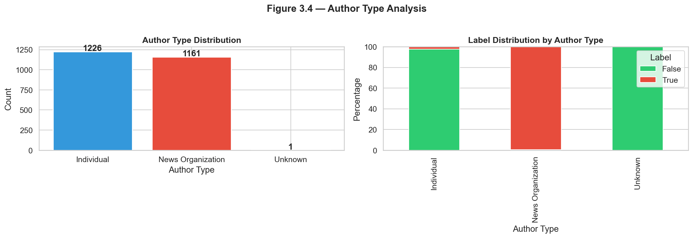

**Takeaway:** Author identity is a major confound. A model that learns source names or account type would likely perform well on this dataset but fail in realistic deployment settings. Author features should therefore be excluded or heavily ablated during modelling.

---

## 4. Multivariate Analysis

### 4.1 Topic × Error Category × Label

The cross-topic error analysis shows that error types are strongly associated with the False label across the dataset. Deepfakes and incorrectly captioned images consistently have very high fake rates across topics. A few small edge cases appear in some topics, which may reflect annotation uncertainty or borderline examples.

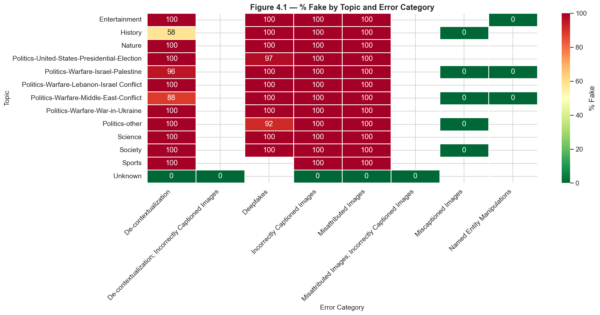

**Takeaway:** Error type is highly informative for analysis, but it is not a modelling input. The main modelling challenge is to infer whether a post is deceptive and, if so, what type of deception it contains.

### 4.2 Temporal Patterns

Misinformation activity is event-driven rather than uniform over time. Major spikes appear around high-profile geopolitical and political events, especially the U.S. presidential election period and conflict-related news cycles.

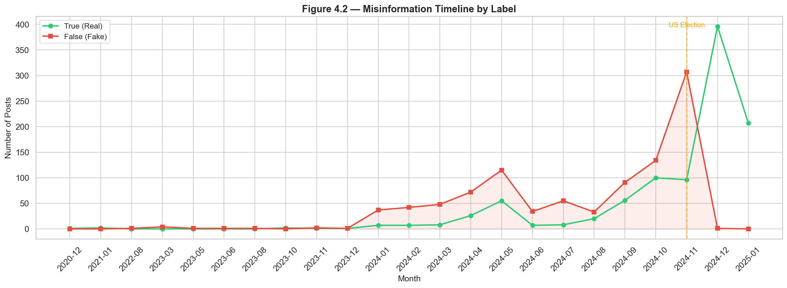

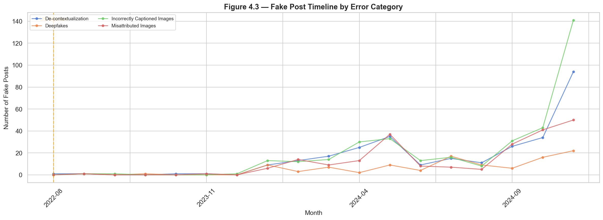

**Takeaway:** Temporal context matters. A practical detection system should be evaluated for robustness across time and, if possible, tested under pre-event and post-event splits.

### 4.3 Text Length × Label × Topic

The relationship between text length and label is topic-dependent:

- In some topics, fake posts are substantially longer than real ones
- In other topics, the difference is smaller or even reversed
- A single global length threshold would not generalise well

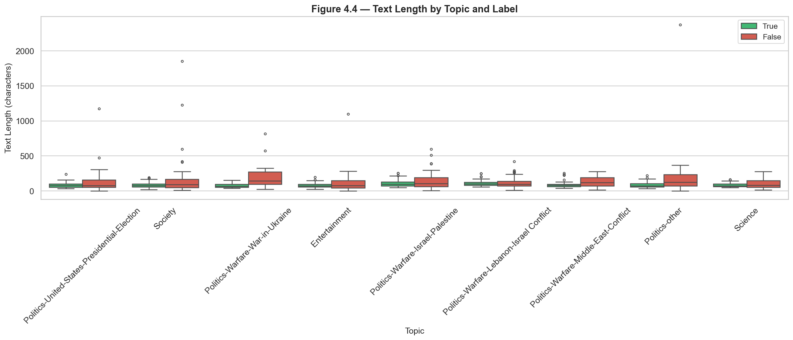

**Takeaway:** Text length can contribute signal, but only when interpreted in context. Topic-aware modelling is more appropriate than relying on a universal heuristic.

---

## 5. Revised Hypotheses

### 5.1 Initial Hypotheses from the Proposal

1. Contemporary data reduces memorisation bias
2. Hybrid retrieval improves detection
3. Multi-step reasoning outperforms chain-of-thought prompting
4. Large MLLMs achieve better zero-shot performance
5. Semi-automatic updates preserve freshness

### 5.2 What the EDA Suggests

| EDA Finding | Implication |
|-------------|-------------|
| The dataset is balanced | Supports fair evaluation without resampling |
| Most misinformation uses real images deceptively rather than synthetic images | Strengthens the case for hybrid retrieval |
| Topics are concentrated around politics and conflict | Topic-aware evaluation is necessary |
| Text length varies by topic | Simple lexical features are insufficient |
| Author identity is a confound | Author features should be excluded or ablated |
| Error categories are annotation artefacts | They should be predicted, not used as inputs |
| Misinformation spikes around major events | Temporal robustness matters |

### 5.3 Revised Hypotheses

1. **Retrieval strategy should match error type.** Image-to-text retrieval should help most for deceptive use of real images, while text-to-text retrieval should be more important for fabricated claims.

2. **Topic-aware models should outperform topic-agnostic models.** Topic context influences misinformation density, text length, and error distribution.

3. **Author identity must be excluded from modelling.** The separation between news organisations and individual accounts is too strong to treat as a reliable signal.

4. **Temporal context provides useful auxiliary information.** A system that accounts for major events should be more robust in real-world use.

5. **Zero-shot MLLM performance will vary by error type.** Deepfakes and other visually sophisticated cases should be evaluated separately from simpler image-caption mismatches.

---

## 6. Modelling Question

Based on the EDA findings, the central modelling question for XFacta is:

> **Given a multimodal social media post with text and image(s), can we determine whether it contains misinformation, and if so, identify the specific misinformation type?**

This breaks into two sub-tasks:

1. **Binary classification:** True vs False
2. **Error-type classification:** For false posts, determine the misinformation category

### 6.1 Recommended Modelling Approach

A multimodal fusion model is the most appropriate direction:

- **Text encoder:** Transformer-based language model such as BERT or RoBERTa
- **Image encoder:** Vision model such as CLIP or ViT
- **Fusion module:** Cross-attention or concatenation before classification

### 6.2 Evaluation Priorities

1. Report metrics separately by topic and error type
2. Remove or ablate author information
3. Validate across time periods, especially around major events
4. Calibrate confidence scores rather than relying only on hard labels

### 6.3 Open Questions

- Should binary label and error type be predicted jointly or in a two-stage pipeline?
- How well do zero-shot MLLMs perform on each error type?
- Does retrieval-augmented generation help more for some categories than others?
- How much does performance drop when author information is removed?

---

## 7. Conclusion

This EDA reveals several important characteristics of the XFacta dataset:

1. The dataset is well structured and broadly balanced.
2. Most misinformation is deceptive reuse of real images rather than pure synthetic generation.
3. Topic and time both matter, especially around geopolitical and political events.
4. Author identity is a confound and should not be treated as a legitimate signal.
5. A multimodal approach is necessary; text-only modelling would miss too much of the available evidence.

These findings directly inform the next milestone. The modelling phase should focus on multimodal reasoning, topic awareness, temporal robustness, and careful confound control.

---

## 8. Figure Appendix

The following figures are exported from `notebooks/eda.ipynb` and referenced throughout this report.

### Section 2 — Univariate Analysis

#### Figure 2.1 — Label (True/False) Distribution Across Datasets

#### Figure 2.2 — Distribution of Real vs Fake Samples

#### Figure 2.3 — Misinformation Error Categories

#### Figure 2.4 — Topic Distribution: All vs Fake Samples

#### Figure 2.5 — Text Length Distribution

### Section 3 — Bivariate Analysis

#### Figure 3.1 — Label Distribution Within Each Error Category

#### Figure 3.2 — Label Percentage by Topic

#### Figure 3.3 — Image Presence & Count vs Label

#### Figure 3.4 — Author Type Analysis

### Section 4 — Multivariate Analysis

#### Figure 4.1 — % Fake by Topic and Error Category

#### Figure 4.2 — Misinformation Timeline by Label

#### Figure 4.3 — Fake Post Timeline by Error Category

#### Figure 4.4 — Text Length by Topic and Label

---

*This report accompanies Milestone M4 for the XFacta project. The supporting notebook (`notebooks/eda.ipynb`) contains the code and figures referenced here.*
